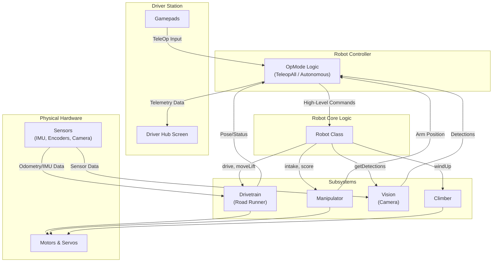
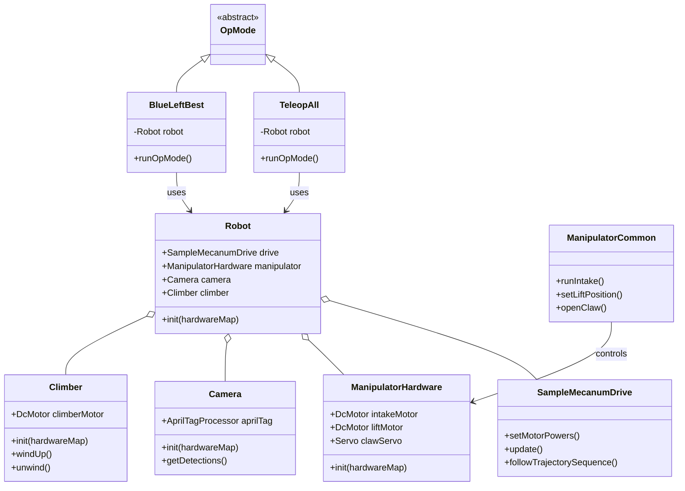

# FTC CENTERSTAGE Project Documentation

This document provides a comprehensive overview of the FTC CENTERSTAGE robot code, detailing its structure, core components, and operational logic. It is intended to help new and existing team members understand the software architecture and contribute effectively.

## Table of Contents

1. [Project Structure](#project-structure)
2. [Core Systems Architecture](#core-systems-architecture)
   * [Functional Architecture Diagram](#functional-architecture-diagram)
   * [High-Level Class Diagram](#high-level-class-diagram)
3. [Detailed File Explanations](#detailed-file-explanations)
   * [Core Robot Structure](#core-robot-structure)
   * [Drivetrain Subsystem](#drivetrain-subsystem)
   * [Manipulator Subsystem](#manipulator-subsystem)
   * [Vision Subsystem](#vision-subsystem)
   * [OpModes: TeleOp](#opmodes-teleop)
   * [OpModes: Autonomous](#opmodes-autonomous)
4. [Helpful FTC Resources](#helpful-ftc-resources)

## Project Structure

The project is organized into three main modules, which is standard for an FTC project:

* \`FtcRobotController\`: This is the core module provided by the FTC SDK. It contains the necessary components to run the robot controller app on the Android device. It also includes a vast number of external samples and examples that demonstrate how to use various sensors, motors, and concepts. **Generally, your team will not modify files in this module.**
* \`TeamCode\`: This is where all of the team's custom code resides. It includes OpModes (TeleOp and Autonomous), robot hardware mappings, subsystems (like drivetrain and manipulator), and computer vision pipelines. This is the primary module your team will work in.
* \`MeepMeepTesting\`: A separate module for running \`MeepMeep\`, a 2D field visualizer. It allows you to simulate and test Road Runner autonomous paths on your computer without needing the robot, which dramatically speeds up autonomous development.

## Core Systems Architecture

Our robot's software is designed around a central \`Robot\` class that aggregates all hardware components and subsystems. OpModes (both \`TeleopAll\` and the various \`Autos\`) then use an instance of this \`Robot\` class to interact with the hardware and execute commands.

### Functional Architecture Diagram

This diagram shows the flow of information and control through the robot's systems. During TeleOp, input flows from the Gamepads to the OpMode, which then sends commands through the \`Robot\` class to the hardware. During Autonomous, the OpMode generates its own commands. In both modes, data from sensors flows back up the chain to be used for control loops and telemetry.



### High-Level Class Diagram

This diagram illustrates the main relationships between the key classes in the \`TeamCode\` module. The OpModes (\`TeleopAll\`, \`BlueLeftBest\`) *use* the \`Robot\` class, which in turn *contains* all the different hardware and software subsystems.



## Detailed File Explanations

This section provides a more in-depth look at the purpose and logic of individual files within the \`TeamCode\` module.

### Core Robot Structure

#### \`Robot.java\`
* **Purpose:** Acts as a central container for all robot hardware and subsystems. It simplifies OpModes by providing a single object (\`robot\`) to access every component.
* **Key Logic:**
  * Declares public instances of all subsystems (\`SampleMecanumDrive\`, \`ManipulatorHardware\`, \`Camera\`, \`Climber\`).
  * The \`init(HardwareMap hwMap)\` method is called at the beginning of every OpMode. It takes the \`HardwareMap\` from the SDK and uses it to initialize all the subsystem objects, which in turn map their specific motors and sensors.
* **State Diagram:** A state diagram is not applicable for this class, as its primary role is structural and for initialization, rather than managing a process with distinct states.

#### \`Climber.java\`
* **Purpose:** Manages the hardware and logic for the climbing mechanism.
* **Key Logic:**
  * Contains the \`DcMotor\` for the climber winch.
  * The \`init(HardwareMap hwMap)\` method maps the motor from the configuration.
  * Provides simple methods like \`windUp()\` and \`unwind()\` that set the motor power to predefined constants.
* **State Diagram:**
  ```mermaid
  stateDiagram-v2
      [*] --> Idle
      Idle --> Winding : windUp called
      Winding --> Idle : stop called
      Idle --> Unwinding : unwind called
      Unwinding --> Idle : stop called
  ```

### Drivetrain Subsystem

#### \`drivetrain/drive/SampleMecanumDrive.java\`
* **Purpose:** The core of the drivetrain, integrating Road Runner's motion planning with the physical hardware.
* **Key Logic:**
  * Initializes the four drive motors and the IMU.
  * Sets motor directions and configures motors to run using encoders.
  * Implements methods required by Road Runner for localization, such as \`getWheelPositions()\`.
  * Contains the \`trajectorySequenceBuilder()\` and \`followTrajectorySequence()\` methods for Autonomous.
* **State Diagram:**
  ```mermaid
  stateDiagram-v2
      [*] --> Idle
      Idle --> ManualControl : setWeightedDrivePower called
      ManualControl --> Idle : Power set to 0
      Idle --> FollowingTrajectory : followTrajectorySequence called
      FollowingTrajectory --> Idle : Sequence completes
  ```

#### \`drivetrain/drive/DriveConstants.java\`
* **Purpose:** A centralized configuration file holding all the essential tuning values for Road Runner. **This file is critical for accurate autonomous movement.**
* **Key Logic:**
  * Contains \`public static final\` variables for robot parameters like \`MAX_VEL\`, \`MAX_ACCEL\`, PIDF coefficients, \`TRACK_WIDTH\`, and \`WHEEL_RADIUS\`.
* **State Diagram:** A state diagram is not applicable for this class, as it is a final class that only stores constant configuration values and has no executable logic or states.

### Manipulator Subsystem

#### \`manipulator/ManipulatorHardware.java\`
* **Purpose:** To declare and initialize all motors and servos related to the pixel manipulator.
* **Key Logic:**
  * Declares \`DcMotorEx\` for the intake and lift, and \`Servo\` for the claw.
  * The \`init(HardwareMap hwMap)\` method gets these devices from the hardware map and sets initial configurations.
* **State Diagram:** Not applicable, as this is a hardware mapping class with no internal states.

#### \`manipulator/ManipulatorCommon.java\`
* **Purpose:** To provide high-level, logical control over the manipulator hardware.
* **Key Logic:**
  * Contains methods like \`runIntake(power)\`, \`setLiftPosition(ticks)\`, \`openClaw()\`, and \`closeClaw()\`.
* **State Diagram (Composite States):**
  ```mermaid
  stateDiagram-v2
      state Lift {
          [*] --> Ground
          Ground --> ScoringLow : setLiftPosition to LOW
          ScoringLow --> Ground : setLiftPosition to GROUND
          ScoringLow --> ScoringHigh : setLiftPosition to HIGH
          ScoringHigh --> ScoringLow : setLiftPosition to LOW
      }
      state Intake {
          [*] --> Stopped
          Stopped --> Intaking : runIntake forward
          Intaking --> Stopped : runIntake stopped
          Stopped --> Outtaking : runIntake reverse
          Outtaking --> Stopped : runIntake stopped
      }
  ```

### Vision Subsystem

#### \`vision/Camera.java\`
* **Purpose:** To manage the webcam and the vision processing pipeline for detecting AprilTags.
* **Key Logic:**
  * Initializes the \`AprilTagProcessor\` and \`VisionPortal\`.
  * Provides a clean \`getDetections()\` method for OpModes to access vision results.
* **State Diagram:**
  ```mermaid
  stateDiagram-v2
      [*] --> Uninitialized
      Uninitialized --> Initializing : init called
      Initializing --> Streaming : VisionPortal starts camera stream
      Streaming --> [*] : OpMode stops
      Streaming: Detections are updated continuously
  ```

### OpModes: TeleOp

#### \`TeleopAll.java\`
* **Purpose:** The primary OpMode for the driver-controlled period.
* **Key Logic:**
  * **Init:** Creates and initializes a \`Robot\` object.
  * **Loop:** Continuously reads gamepad inputs and calls methods on the robot's subsystems.
* **State Diagram (OpMode Lifecycle):**
  ```mermaid
  stateDiagram-v2
      [*] --> Initializing : User presses INIT
      Initializing --> WaitingForStart : robot init completes
      WaitingForStart --> Looping : User presses START
      Looping --> Looping : opModeIsActive is true
      Looping --> Stopped : Timer ends or user presses STOP
      Stopped --> [*]
  ```

### OpModes: Autonomous

#### \`Autos/real/BlueLeftBest.java\` (and similar files)
* **Purpose:** A specific, pre-programmed autonomous routine.
* **Key Logic:**
  * **Init:** Initializes hardware and uses the camera to detect the team prop's location.
  * **Run:** Builds and executes a Road Runner \`TrajectorySequence\` based on the detected prop location.
* **State Diagram (Autonomous Logic Flow):**
  ```mermaid
  stateDiagram-v2
      [*] --> Initializing
      Initializing --> DetectingProp : robot init done
      DetectingProp --> WaitingForStart : Prop location saved
      WaitingForStart --> ExecutingPath : User presses START
      ExecutingPath --> Parking : Trajectory sequence completes
      Parking --> Stopped : Park trajectory ends
      Stopped --> [*]
  ```

## Helpful FTC Resources

* **FTC Game Manuals:** The official rules and documentation for the current season.
  * [FTC Resource Library](https://www.firstinspires.org/resource-library/ftc/game-and-season-info)
* **Road Runner Documentation:** The official guide for the motion planning library used in this project. Essential for understanding and tuning the drivetrain.
  * [Learn Road Runner](https://learnroadrunner.com/)
* **FTC Javadocs:** The official documentation for the FTC SDK classes and methods.
  * [FTC Javadoc](https://javadoc.io/doc/org.firstinspires.ftc)
* **Game Manual Zero:** A community-driven guide that explains many core FTC concepts in an easy-to-understand way.
  * [GM0](https://gm0.org/en/latest/)
